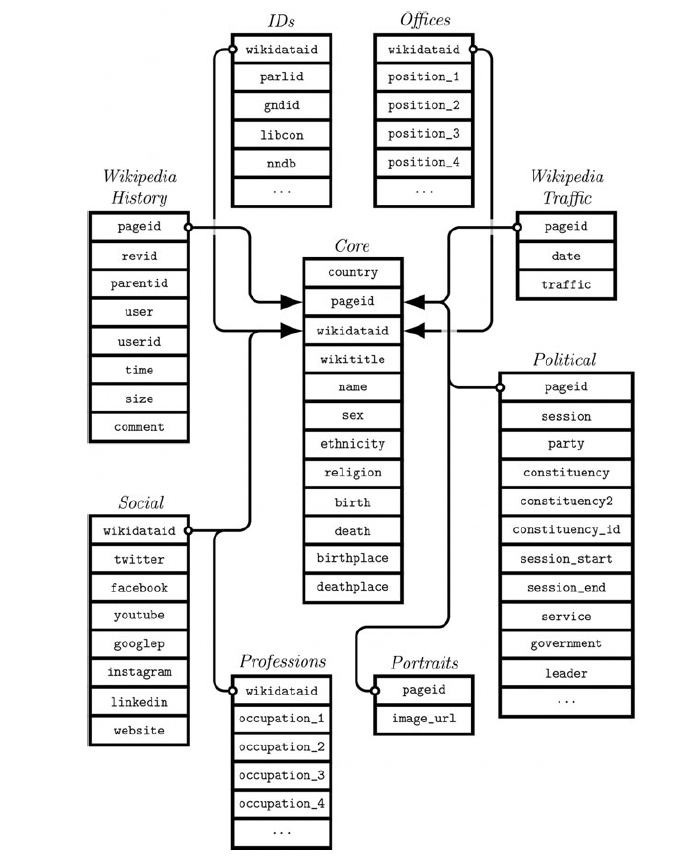

# 1. Summary 

The project aims to measure gender bias in politicians' Wikipedia biographies. Wikipedia ranks as the seventh most visited website worldwide in 2022 ([Statista 2023](https://www.statista.com/statistics/1201880/most-visited-websites-worldwide/)), with over 4 billion unique global visitors per month ([Statista 2023](https://www.statista.com/statistics/1259907/wikipedia-website-traffic/)). Many individuals rely on it to quickly access information about celebrities, artists, and politicians. Therefore, it is crucial for Wikipedia's content to maintain neutrality and avoid reinforcing societal biases.
One could argue that this importance is heightened within the subgroup of politicians, as Wikipedia's representation of political figures influences citizens seeking information before elections in democratic processes. Previous research has revealed a noticeable lexical gender bias in Wikipedia biographies. I specifically focus on politicians' biographies to investigate whether general findings can be applied to this specific subgroup. Additionally, much of the existing research concentrates on English articles, whereas I analyze all politicians' texts in their respective national languages. This approach potentially allows to compare the extent of gender bias across different countries.
My research questions are as follows:

**RQ1:** Can results of previous research concerning lexical gender bias in biographies be applied to the subgroup of (german) politican's biographies?

Depending on capacity, a second question will be examined, focusing on the international perspective:

**RQ2:** Do the outcomes across different countries accurately mirror the gender inequalities present in those countries' real-world situations?

I plan to address these questions using available data from the "Comparative Legislator Database," [@gobel_comparative_2022] which includes information about politicians, their Wikipedia names, and additional details such as traffic and edits from nine countries ('aut,' 'can,' 'cze,' 'esp,' 'fra,' 'deu,' 'irl,' 'sco,' 'gbr,' 'usa_house,' or 'usa_senate'). Initially, I will retrieve all articles in their original language and then assess the extent of gender bias in the articles, first using simple descriptive indicators and secondly either employing mutual pointwise information or a machine learning approach. The results will be contextualized using existing research.

# 2. Motivation and background

**“Representation of the world, like the world itself, is the work of men; they describe it from their own point of view, which they confuse with absolute truth.”** – Simone de Beauvoir

This research topic is particularly intriguing to me, as I have been interested in gender equality topics for several years now. During my studies, I have delved into the concept of the child penalty and worked on addressing the gender care gap in my student job. These experiences have motivated me to explore gender-related inequalities further.
In the scope of my master's thesis at Hertie School, I aim to look deeper into such issues in the online world and utilize the techniques I have acquired during my studies. Thus, this research topic is very exciting for me, and I am curious to dive deeper into gender inequalities in the political area.
As a public policy student, the category of politicians is specifically interesting to me. Inequalities in this sphere are particularly noteworthy as politicians online representation impacts people's perception of them and thus has a real-life impact in democratic processes. So, misrepresentation in the form of gender bias can be seen as problematic for democratic processes, as citizens use online platforms like Wikipedia to inform themselves, expecting a neutral voice.
I expect to acquire skills in the field of text data processing, which will be advantageous for my future career. I aspire to work in the political sphere after my graduation, and a lot of political data is in the form of text. Thus, I hope to gain some knowledge that will be useful for my next steps after university.

# 3. Introduction

Gender bias can be defined as "the term used to describe systematic biasing effects that result from gender-related stereotyping and prejudice." [@leibniz_association_gender_2023] The rise of gender studies and research about those systematic effects revealed the existence of various such biases against women. There is studies on gender bias in academia [@leagur_of_european_research_universities_implicit_2018] at the workplace [@heilman_gender_2012], in medicine [@mendelsohn_sex_1994], sports [@eastman_sportscasting_2000], in politics [@chiao_political_2008] - and this list could go on. Research has for example shown variations in the adjectives used to describe women compared to those used for men across various contexts [@trix_exploring_2003]. While sometimes those biases are rather easy to detect, the field of Wikipedia,as an encyclopedia is particularly interesting, as it feigns objectivity. Wikipedia is an online source, produced and revised by volunteers globally. Thus, it is not far fetched to expect societal biases reflected in its articles, often this might be unconscious, as individuals often engage in discriminatory behaviors without conscious intent, acting upon internalized schemas [@leagur_of_european_research_universities_implicit_2018]. Furter, research has shown that an overwhelming majority of editors are male: Less than 13% of Wikipedia contributors are female. [@antin_gender_2011]

"Throughout human history, a disproportionate degree of political power around the world has been held by men." [@chiao_political_2008, p.1] Thus, it is important to find sources and ways to reduce gender bias, starting by detecting its existence.
There is a growing body of research on gender bias in politics, as the proportion of male to female politicians is often very uneven [@kumar_participation_2014]. Even though this presence of gender gaps in private and public leadership positions has long been identified and efforts have been taken to change this, the following statement from [@chiao_political_2008] still holds to this day.

The area of research focusing on gender bias in wikipedia has developed in the last few years and is mainly focussed on English articles and general biographies (not focusing on one specific category of people). The following 3 papers are of a main interest, when dealing with lexical gender bias on wikipedia:

**1. "Women through the glass ceiling: gender asymmetries in Wikipedia"**
[@wagner_women_2016] aim at assessing potential gender inequalities in English Wikipedia articles along different dimensions using the The DBpedia dataset. Adopting an open vocabulary approach, they consider n-grams with \( n \leq 2 \) 2 to encompass multi-word concepts. The analysis involves exploring the association between the top 200 n-grams for each gender and the four topics (gender, relationship, family, or other), with Pointwise Mutual Information used for ranking the n-grams for men and women. Among other findings, they achieve to show that family-, gender-, and relationship-related topics are more present in biographies about women, which is a clear indicator for a lexical bias.

**2. “First Women, Second Sex: Gender Bias in Wikipedia”**
[@graells-garrido_first_2015] deal with the question wether there is a gender bias in in Wikipedia and if so, how to identify and quantify it. For this, they use the DBPedia 2014 dataset and The Wikipedia English Dump of October 2014. They rely on several approaches to estimate the gender bias in the articles, among others they use Pointwise mutual information and find that “Sex-related content is more frequent in women biographies than men’s, while cognition-related content is more highlighted in men biographies than women’s”.

**3. “It's a Man's Wikipedia? Assessing Gender Inequality in an Online Encyclopedia” [@wagner_its_2021]**
 As in the previous paper, Wagner et al. assess potential gender inequalities in Wikipedia articles along different dimensions (coverage bias, structural bias, lexical bias and visibility bias). In this paper they also include several language editions and compare their results with the Gender Inequality Index of the World Economic Form (WMF) [@world_economic_forum_global_nodate] to  draw a connection between bias in the offline and online world. The authors use collections of notable people as reference datasets, crawling the articles for the dataset’s individuals. To assess the amount of lexical bias, they, again, use an open vocabulary approach. Instead of an analysis of the PMI, as in the previous paper, they use tfidf scores to train a Naive Bayes classifier. Further, they employ log likelihood ratios (L(word, g)) to assess which words are most effective in discerning the gender of the person mentioned in an article.The lexical analysis shows “that articles about women tend to emphasize the fact that they are about a women (...) while articles about men don’t contain words like “man”, “masculine” or “gentleman”.” (@wagner_its_2021, p.458)

# 4. Research question

The main research question is the following:
  
**RQ1: Can results of previous research concerning lexical gender bias in biographies be applied to the subgroup of (german) politican's biographies?**

I will begin the analysis with german text and if there is enough capacity, also include other countries
Potentially, the international perspective will be elaborated with a second research question:
  
**RQ2: Do the outcomes across different countries accurately mirror the gender inequalities present in those countries' real-world situations?**

The approach reflects previous research on this topic, specifying the examined group, focusing on politicians, instead of generic biographies on wikipedia. I will mainly examine lexical gender bias, meaning, different language representation of females and males which is one of many possible kinds of biases (Coverage Bias, visibility bias etc.)

**Hypotheses**

H1: The findings from previous research about all categories of biographies can be applied to politicians. As demonstrated in the Finkbeiner test [@finkbeiner_what_2013], women's biographies are expected to emphasize their gender, whereas descriptions of men are presented as neutral.

# 5. Data and methods

**Data:**

I am using the data of the Comparative legislature Database (@gobel_comparative_2022), containing information (including sex, wikititle, traffic, edits etc.) on more than 67,000 contemporary and historical legislators. To gather the according wikipedia articles of the politicians, I use the wikipediR package. I use a subset of politicians that don't have a date of death recorded in the data and thus are contemporarian politicians, as I am rather interested in the gender bias towards politicians that are known as (acting) politicians, not as historical figures. The data includes 10 available countries: Canada, Germany, France, Czech Republic, USA, Ireland, Scotland, Austria and Spain. Figure 1 gives an overiew of structure of the database

. 

Figure 1: Structure of the database [@gobel_comparative_2022, p.7]

**Method:**

**Decriptive analyis**

The start of the analysis will be a descriptive analysis of the available data. Figures like the length of the articles have already been used in previous research to get an impression of possible bias (@graells-garrido_first_2015). For my analysis, I plan to use the average monthly page traffic as a matching variable to only include comparable female and male politicians. This serves the purpose of reducing the influence of possible confounders - I expect the biggest confounder in this case to be the popularity of certain politicians. Monthly page traffic seems like a good proxy to reduce this confounding factor. Further, I want to compare not only the article length but also the number of page edits of the female and male politicians.

**Further analysis**

The descriptive analysis will be followed by a  technique to detect gender bias in the text, focusing on the kind of bias that is pretty common based on previous research (@wagner_women_2016), namely lexical bias. Lexical bias means that language is used differently when talking about men/women [@lakoff_language_1973]. I want to propose two possible methods to analyse the extend of lexical bias in politicians biographies. Depending on the complexity of the method, a focus on one or few countries may be advantageous (e.g. focusing on German politicians and or compare to one/few other countries) as the methods have to be applied to each country individually.

**Option 1**

The method to detect gender bias is inspired by [@wagner_women_2016] and has been used by other authors as well to assess lexical bias [@graells-garrido_first_2015] For this method, Pointwise Mutual Information (PMI) is used to find out which words are strongly associated with articles of females/males.

Previous research has often focused on the Wikipedia introduction text to detect bias. In my analysis, I plan to include the whole text as I expect the introduction texts for politicians to be rather simple, similar and short, whereas the other sections include more relevant information for the analysis. 

- First step of this approach is to tokenize the wikipedia articles and to create the vocabulary, containing “gender”, “word” and “Number of biographies” containing this word. 
- Next, stopwords are removed, and only words that are present in both genders are included. 
- After creating a dataframe that contains all common words of female and male politicians, with the respective frequency for men/women, the PMI scores for the vocabulary are calculated. PMI is expressed as: \( \text{PMI}(c, w) = \log \frac{p(c, w)}{p(c)p(w)}
\)
C represents the gender and w represents the word. 
- Further, the PMI score needs to be normalized for further analysis. 
- PMI gives extra weight to words with very low frequencies thus I need to establish a threshold for words to be included. PMI helps identify words that tend to occur together with a specific gender term more frequently than expected by chance - so, higher PMI values indicate a stronger association between a word and a specific gender. 
- The next step is thus to sort the resulting PMI values decreasingly for each gender. 
- Following the approach tested by [@wagner_women_2016], the top 200 words are manually annotated and put in categories: Family, Relationship, Gender, Other. 
- To assess differences between the genders, a chi-square test is used for the categories of men and women. Further, word Clouds or other visualization techniques can be used to show the results of the analysis for each gender.

**Alternative**

The second possible method is a machine learning approach as applied by [@wagner_its_2021]or [@brun_wikigender_2022] before. 

* Again, this is an open vocabulary approach. 
* Firstly, it includes stemming the words of the wikipedia articles and creatign a corpus with wikipedia articles categorized by gender
* Then, Term Frequency-Inverse Document Frequency scores (tfidf Scores) are computed, used to evaluate the importance of a word in a document relative to a collection of documents (corpus). 
* These Scores are used as features to train a Naive Bayes classifier, which serves the purpose of identifying words that effectively differentiate the gender of the individual discussed in an article. 
* After identifying these important discriminative features by assessing feature importance, the same method as above can be used to annotate and categorize the words.

**International analysis**

As I am particularly interested in the German case, as a German speaker and having gained experiences in gender inequalities in Germany, I will firstly apply the respective methods to the German language.
If there is enough capacity to apply the method to several countries, I will continue with English and French speaking countries (as I speak those languages and I am able to annotade words myself). An alternative would be to group all countries with the same language (e.g. Germany and Austria) but as I ideally aim to compare my results on a country level, I decided against this option.
If I can apply my method to several countries, I aim at comparing the country level of gender equality, measured by the Gender Inequality Index of the World Economic Form (WMF) [@world_economic_forum_global_2023] with the results of my lexical bias analyis to see, if there is a connection. This way of comparing bias in the offline world and the bias on Wikipedia has been conducted by [@wagner_its_2021] before.

# Bibliographie:
<!-- Leerzeile -->

